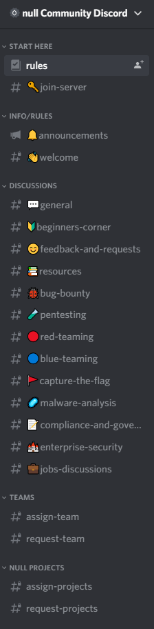
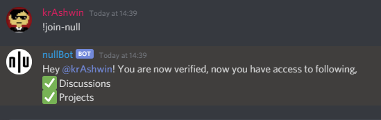
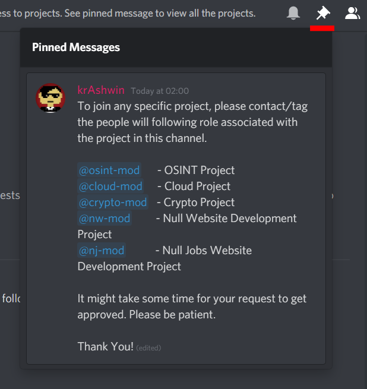

# Hey There!

If you are new to the server there will be a few channels seen to you, in order to get access to all the other channels you'll have to verify yourself.

**To verify, abide by the rules and click on the null reaction or type `!join-null` in #join-server channel.**

Once you are verified you'll have the `hacker` role and will have access to other general channels like Discussions and Projects.

### Channel Descriptions

**START HERE**

- `#rules` - Please go through all the messages in this channels. It contains more information on how to interact more in the community.
- `#join-server` - In this channel you can verify yourself by typing `!join-null` and the null bot will verify you and you will get access to other categories like Discussions and Projects.

    

**INFO/RULES**

- `#announcements` **-** All the further announcements about events, workshops or projects will be shared here.
- `#welcome` **-** Member welcome logs are present here.

**DISCUSSIONS**

- `#general` **-**  Any help or any discussions on any topics can be done here.
- `#beginners-corner` **-** This channel is for newbies, trying to break into the field of security. Feel free to ask anything, even if you feel it's not a great question!
- `#feedback-and-requests` **-** Any feedback or requests can be sent to the moderators using this channel.
- `#resources` **-** Any resources, that you think can be helpful for the community is to be shared in this channel.
- `#bug-bounty` **-** Any discussions related to bug bounty can be done in this channel.
- `#pentesting` **-** Any discussions related to pentesting can be done in this channel.
- `#red-teaming` **-** Any discussion related to offensive side of security.
- **`#blue-teaming` -** Any discussion related to defensive side of security.
- `**#capture-the-flag` -** Any discussion about the capture the flag events or vulnerable machines can be held here
- **`#malware-analysis` -** Any discussion related to malware analysis can be held here.
- `#compliance-and-governance` **-**  Any discussion related to compliance and governance can be held here.
- `#enterprise-security` **-**  Any discussion related to enterprise security and administrations can be held here.
- `#jobs-discussions` - Everyone can discuss about jobs, their experiences and ask for tips and anything related to jobs in general.

**Channels will be added or removed according to the requirements.**

**NULL PROJECTS**

- `#request-projects` **-** You can request the Project moderators to allow you to get added in a project. Project Details are in the #rules channel. Also see pinned message for details and point of contact for each project.

    

**TEAMS**

- `#request-team` - You can request to be a part of a team, by tagging the role associated with the message. See pinned message for teams details.
- `#assign-team` - [Read-Only] Here the moderators will assign you the role.
- `#assign-projects` - [Read-Only] Here the moderators will assign you the role.