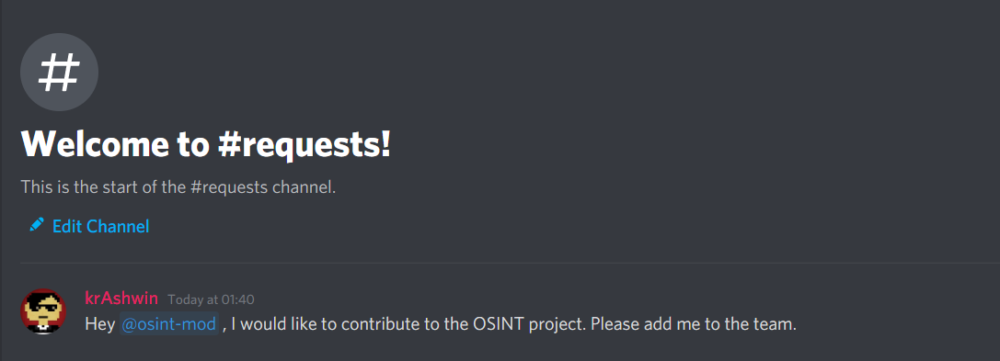
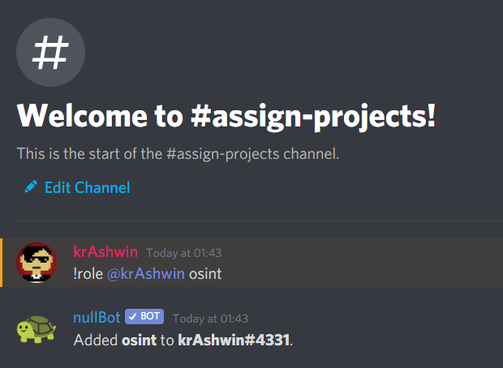
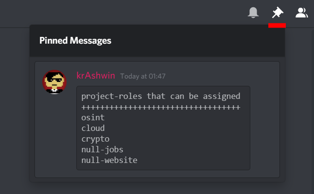

# Project and Team Moderators

For people having role of project moderators.

In **NULL PROJECT** category, you'll have an extra channel available that is not available for other project contributors - `#assign-projects` and for teams it will be `#assign-team`

Since, we cannot give any one access to any projects or teams, the moderators will have to do it manually.

People can request to be added in a project using the `#request-projects` channel and then the project moderators will have to write the following command to assign that user, project role.

Similarly, people can request to be added in a team using the `#request-team` channel and then the team moderators will have to write the following command to assign that user, team role.

Example

Suppose there is a user - **krAshwin ,** who wants to join the `osint` project and asks in the **#requests** channel.

So, the person with the `@osint-mod` role will come to `#assign-projects` channel and type the following command that is in the format: (Same applies for the team moderators)

`!role @username project-role`

The project roles will be specified in the pinned message. To see the pinned message click on the pin icon in the top right corner.

**Type the same command to remove a person from the project.** Once, the project role will be given to anyone the project channel will be available to them.